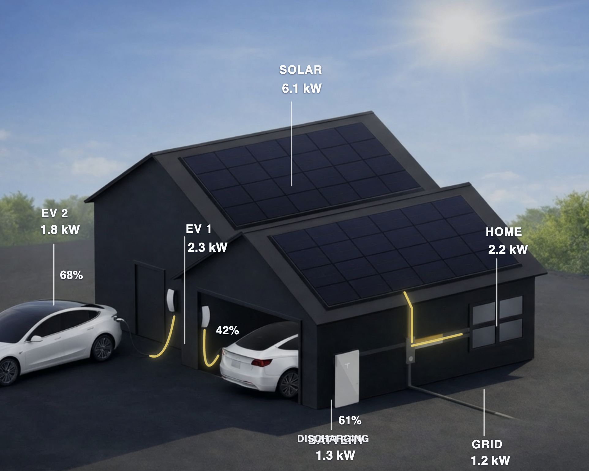
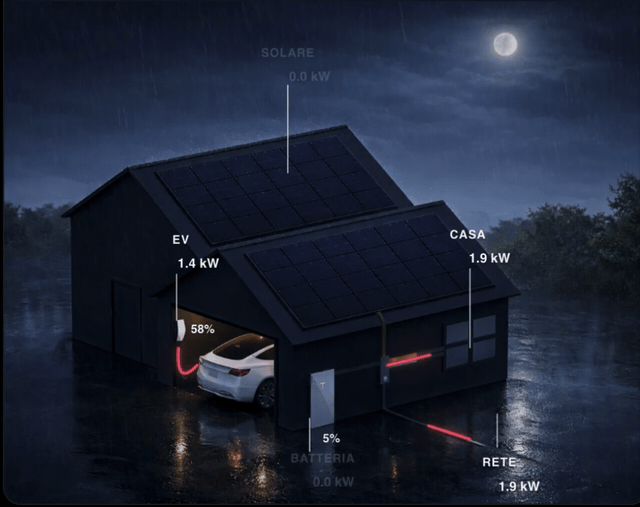
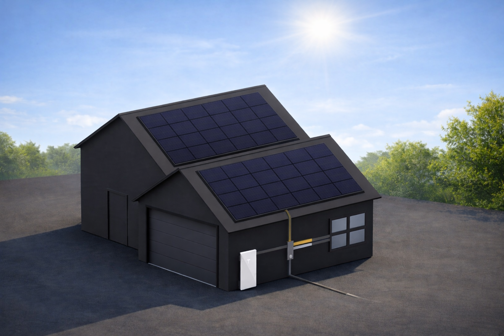
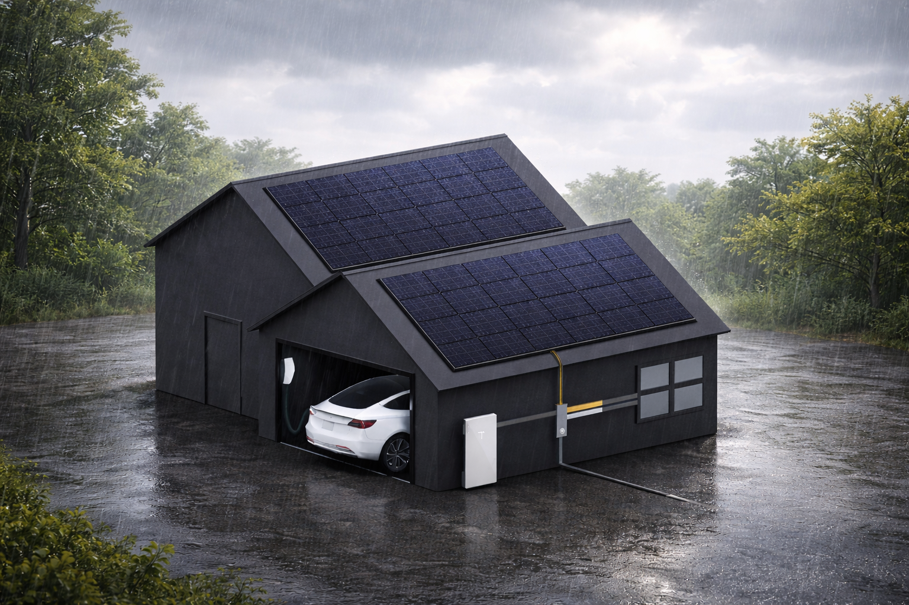
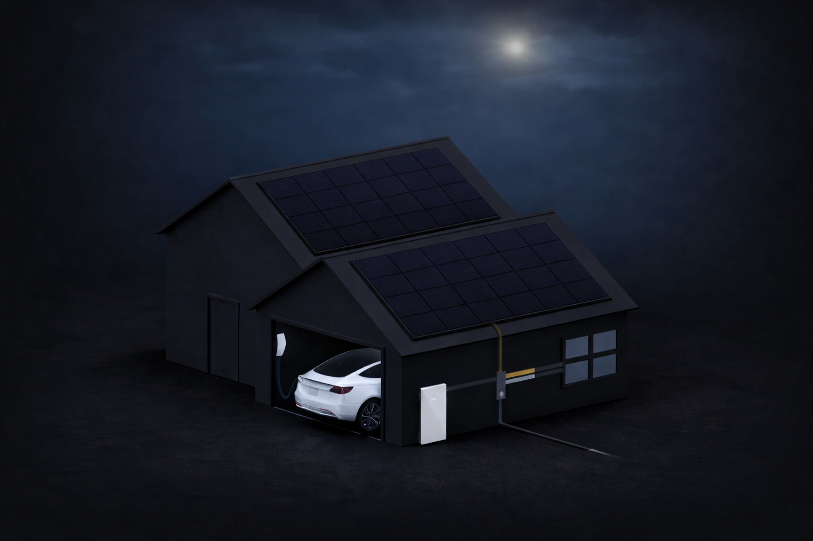
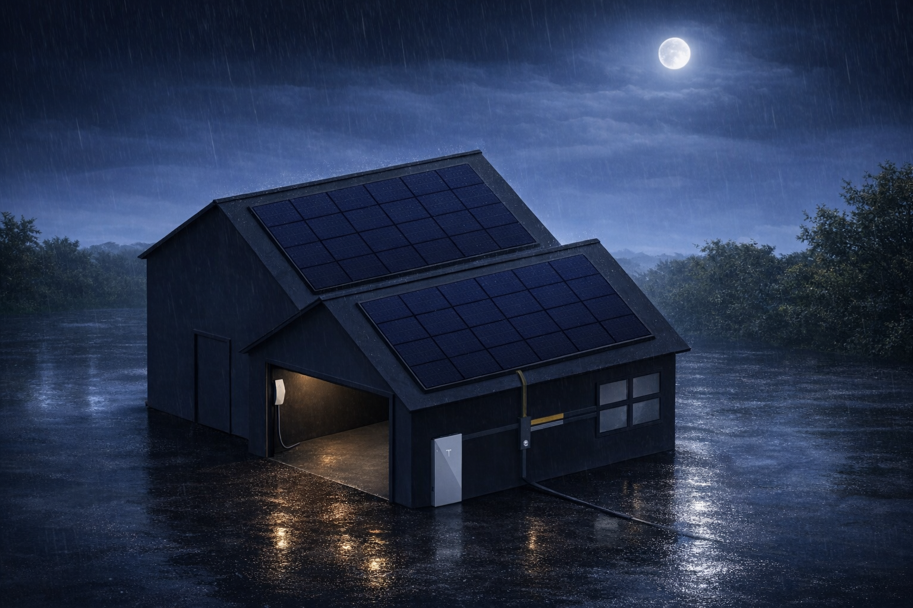
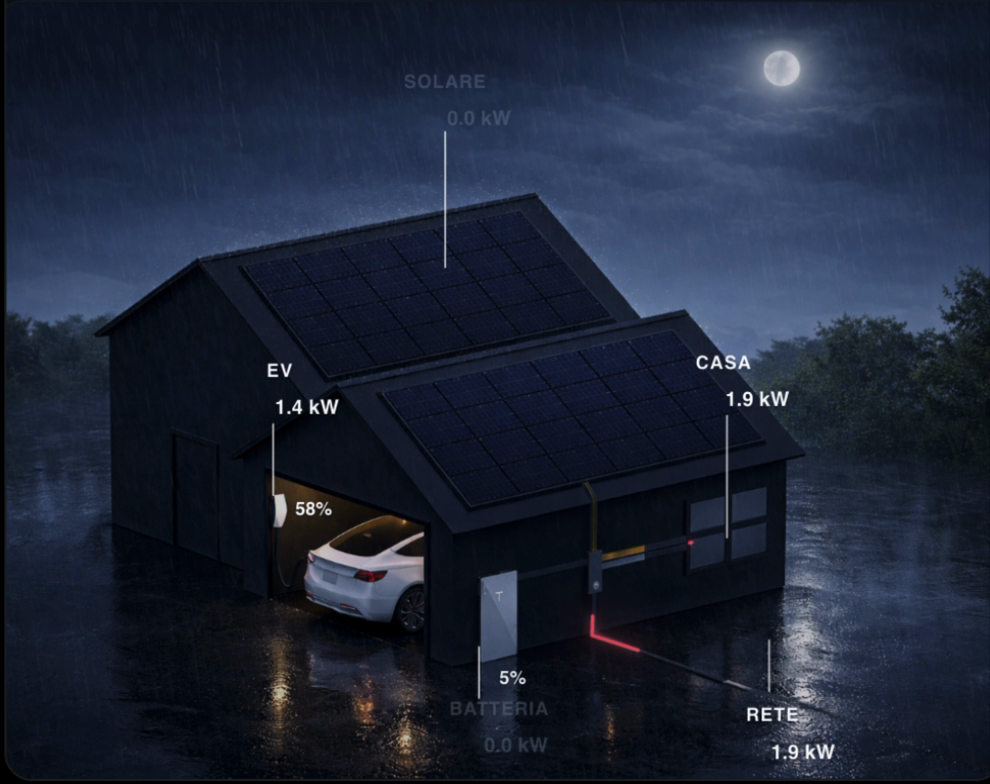

# Tesla Style Energy Flow

Custom Home Assistant Lovelace card for energy flows on a house scene, with dynamic weather/day-night backgrounds and EV-aware layout switching.

[](https://my.home-assistant.io/redirect/hacs_repository/?owner=stexecute&repository=tesla-style-energy-flow&category=dashboard)





[Watch demo video](docs/media/tesla-style-energy-flow-demo.mp4)

[Features](#features) • [Installation](#installation) • [Usage](#usage) • [Screenshots](#screenshots) • [Files](#files) • [License](#license)

## Features

- Smooth animated SVG flow lines
- Flow colors by source: solar = yellow, battery = green, grid = red
- Dynamic background (weather + day/night + EV charging)
- Scene-specific label/guide positioning for each background
- Optional dual-EV support with separate EV1 / EV2 power, battery and charging switch entities
- Optional `scene_path_map` and `scene_component_map` overrides for custom dual-EV backgrounds
- Config editor with entity dropdowns
- Multilanguage UI (`auto`, `it`, `en`, `es`, `fr`, `de`)
- Configurable thresholds for flow visibility:
  - `thresholds.solar_min_w`
  - `thresholds.grid_min_w`
  - `thresholds.battery_min_w`
  - `ev_min_w`
- Optional `ev_hide_when_idle` to hide EV labels/guide when not charging
- Optional `show_header` to show or hide the card title
- Optional `font_scale` to improve readability on compact cards or tablet layouts
- Optional `battery_invert` if your battery sensor uses the opposite sign convention
- Battery node hidden automatically when no battery entities are configured
- Battery percentage remains readable even when battery power is idle
- Simplified node status text with battery-focused charging/discharging state

## Installation

### HACS (Custom Repository)

1. HACS -> Frontend -> Custom repositories
2. Add this GitHub repo URL: `https://github.com/stexecute/tesla-style-energy-flow`
3. Category: `Dashboard`
4. Install `Tesla Style Energy Flow`
5. Refresh browser cache

### Manual

1. Copy package files to:
   - `dist/tesla-style-energy-flow.js` -> `/config/www/community/tesla-style-energy-flow/tesla-style-energy-flow.js`
   - `dist/backgrounds/*` -> `/config/www/community/tesla-style-energy-flow/backgrounds/*`
2. Add Lovelace resource:

```yaml
lovelace:
  resources:
    - url: /local/community/tesla-style-energy-flow/tesla-style-energy-flow.js
      type: module
```

3. Reload frontend (or restart Home Assistant)

## Usage

```yaml
type: custom:tesla-style-energy-flow
title: Tesla Style Energy Flow
show_header: true
language: auto
background: /local/community/tesla-style-energy-flow/backgrounds/scene_day_clear_idle.png
dynamic_background: true
background_asset_base: /local/community/tesla-style-energy-flow/backgrounds
battery_invert: false
grid_invert: false
font_scale: 1.0
ev_hide_when_idle: false
ev_min_w: 150
thresholds:
  solar_min_w: 50
  grid_min_w: 50
  battery_min_w: 50
entities:
  solar_power: sensor.solar_power
  roof_a_power: sensor.roof_array_a_power
  roof_a_voltage: sensor.roof_array_a_voltage
  roof_a_current: sensor.roof_array_a_current
  roof_b_power: sensor.roof_array_b_power
  roof_b_voltage: sensor.roof_array_b_voltage
  roof_b_current: sensor.roof_array_b_current
  grid_power: sensor.grid_power
  battery_power: sensor.battery_power
  load_power: sensor.home_load_power
  battery_level: sensor.battery_level
  ev_power: sensor.ev_charging_power
  ev_battery: sensor.ev_battery_level
  ev_charge_switch: switch.ev_charge
  ev2_power: sensor.ev2_charging_power
  ev2_battery: sensor.ev2_battery_level
  ev2_charge_switch: switch.ev2_charge
  weather: weather.home
  sun: sun.sun
```

The card ships with built-in SVG flow paths and scene presets, so no extra `paths:` block is required for a normal install.

The second EV is optional. If `ev2_*` entities are not configured, the card behaves exactly like the single-EV version.

Optional roof array sensors can also be added for two array overlays:

- `roof_a_power`
- `roof_a_voltage`
- `roof_a_current`
- `roof_b_power`
- `roof_b_voltage`
- `roof_b_current`

For custom dual-EV scenes you can also override per-scene geometry through:

- `scene_path_map`
- `scene_component_map`

## Screenshots

Day clear (idle)



Day rain (EV charging)



Night clear (EV charging)



Night rain (idle)



Night rain (grid + home + EV)



## Files

- `dist/tesla-style-energy-flow.js`: packaged card file used by HACS
- `dist/backgrounds/`: packaged background assets used by HACS
- `hacs.json`: HACS metadata
- `examples/lovelace-card.yaml`: config example
- `docs/screenshots/`: preview images for README

## License

MIT
