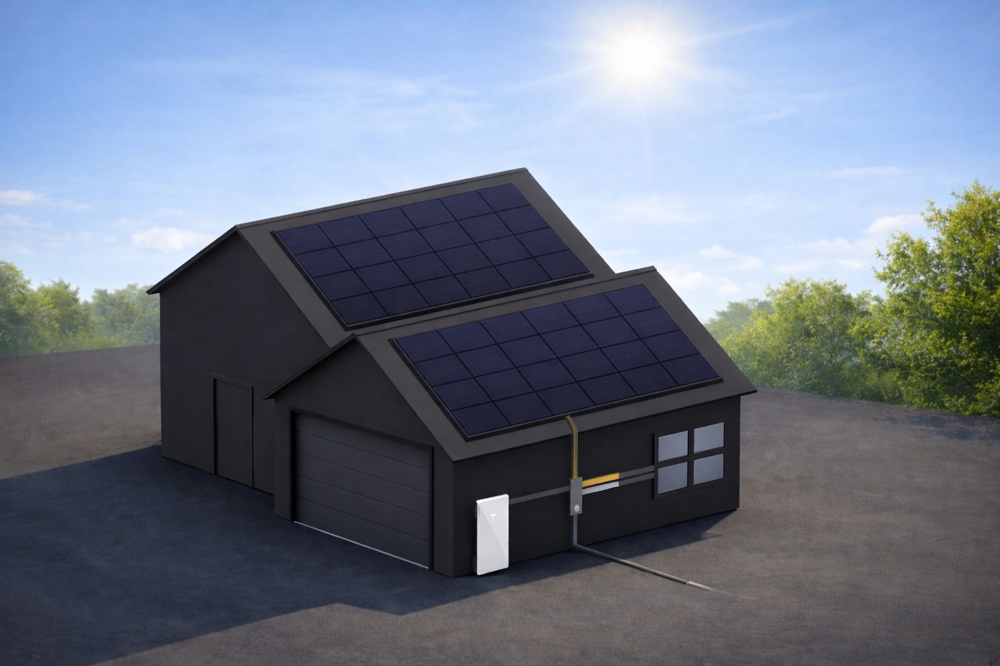
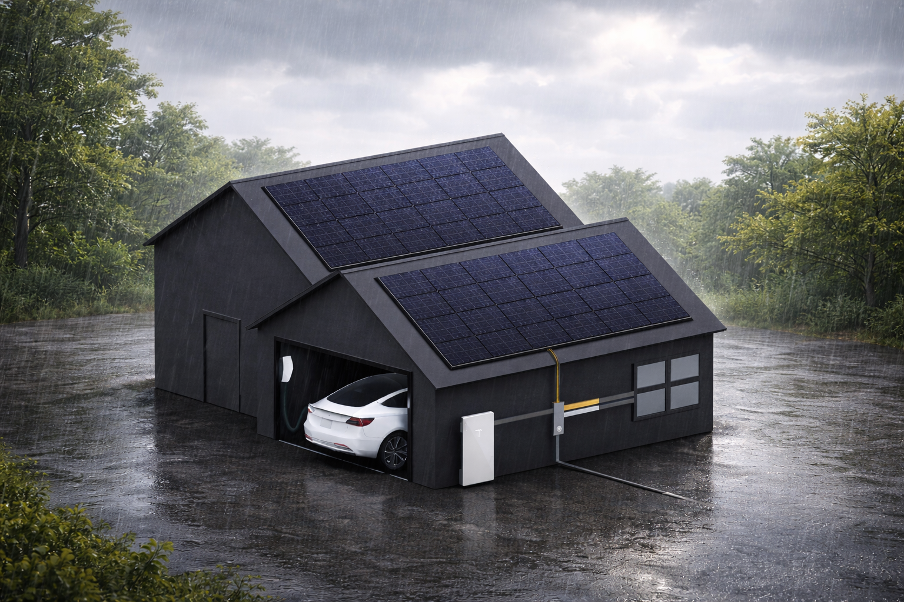
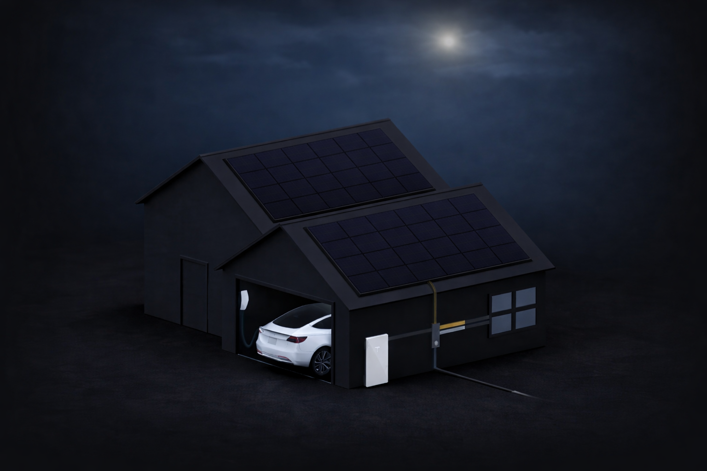
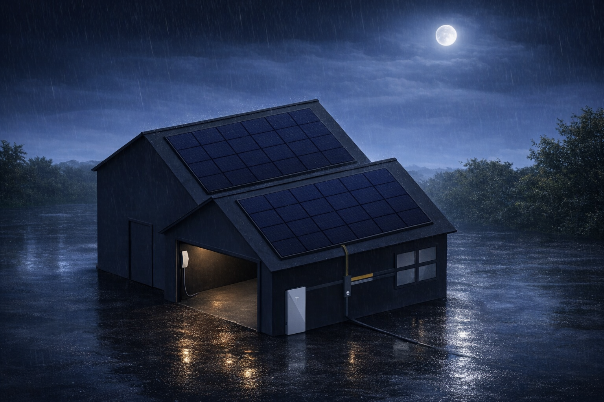
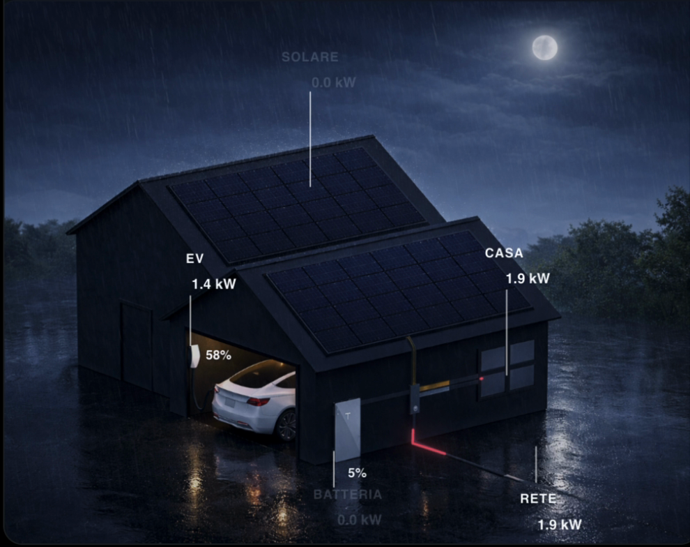

# Tesla Style Energy Flow

Custom Home Assistant Lovelace card for energy flows on a house scene, with dynamic weather/day-night backgrounds and EV-aware layout switching.

> **Fork notice** — This is a community fork of
> [stexecute/tesla-style-energy-flow](https://github.com/stexecute/tesla-style-energy-flow)
> (MIT). The following were contributed by this fork and already merged into upstream:
> visual scene-position editor, editor debouncing, Tesla-style label hierarchy,
> scene tone gradients per time-of-day, extended `background_map` keys.
>
> This fork currently adds the following on top of upstream (PR #22 open):
>
> - **fix:** Grid → Battery flow animation now always shown when the
>   grid charges the battery (with or without simultaneous solar) *(not fully tested — feedback welcome)*
> - **feat:** Separate battery charge / discharge power entities —
>   `battery_charge_power` and `battery_discharge_power`
> - **feat:** Separate grid import / export power entities —
>   `grid_import_power` and `grid_export_power` (SMA SHM 2.0, Victron, Fronius, …)
> - **feat:** Smart entity filtering in editor dropdowns (W/kW, %, V, A)
> - **refactor:** Fully restructured editor UI — sensors grouped by topic,
>   visual editor button at the top, friendly names in dropdowns
>
> Upstream maintainer: [@stexecute](https://github.com/stexecute).
> Until PR #22 is merged this fork can be installed as a HACS Custom Repository.

[](https://my.home-assistant.io/redirect/hacs_repository/?owner=stexecute&repository=tesla-style-energy-flow&category=dashboard)


[Features](#features) • [Installation](#installation) • [Usage](#usage) • [Heat pump](#heat-pump) • [Troubleshooting](#troubleshooting) • [Screenshots](#screenshots) • [Files](#files) • [License](#license)

## Features

- Smooth animated SVG flow lines
- Flow colors by source: solar = yellow, battery = green, grid = red
- Dynamic background (weather + day/night + EV charging)
- Scene-specific label/guide positioning for each background
- Optional dual-EV support with separate EV1 / EV2 power, battery and charging switch entities
- Optional `ev_label` / `ev2_label` for custom vehicle names
- Optional `roof_a_label` / `roof_b_label` for custom PV array names
- Optional `ev_presence` / `ev2_presence` to show the EV scene when a vehicle is at home, even if it is not charging
- Optional `scene_path_map` and `scene_component_map` overrides for custom dual-EV backgrounds
- Config editor with entity dropdowns
- Multilanguage UI (`auto`, `it`, `en`, `es`, `fr`, `de`)
- Configurable thresholds for flow visibility:
  - `thresholds.solar_min_w`
  - `thresholds.grid_min_w`
  - `thresholds.battery_min_w`
  - `thresholds.heat_pump_min_w`
  - `ev_min_w`
- Optional `ev_hide_when_idle` to hide EV labels/guide when not charging
- Optional `ev_in_load` / `ev2_in_load` for whole-home meters that already include the wallbox draw in `load_power` (SMA SHM 2.0, SolarEdge total_consumption, …) — the card subtracts EV power from load before flow allocation so the battery is not double-counted
- Optional `heat_pump_power` entity adds a dedicated **Heat Pump** node — outdoor unit artwork, an amber feed line from the distribution box, and day/rain/night sprite variants. Hidden automatically when not configured. See [Heat pump](#heat-pump)
- Optional `heat_pump_in_load` for whole-home meters that already include the heat pump's draw in `load_power` — same double-counting fix as `ev_in_load`, applied to the heat pump
- Optional `smoothing_seconds` (Tesla-style EWMA, default `0`) — set to e.g. `10` to dampen the cloud-induced jumpiness on Solar, Grid, Battery, Load. EV power stays unsmoothed so start/stop transitions remain instant.
- Optional `show_header` to show or hide the card title
- Optional `font_scale` to improve readability on compact cards or tablet layouts
- Optional `battery_invert` if your battery sensor uses the opposite sign convention
- Battery node hidden automatically when no battery entities are configured
- Battery percentage remains readable even when battery power is idle
- Simplified node status text with battery-focused charging/discharging state

## Installation

### HACS (Custom Repository)

1. HACS -> Frontend -> Custom repositories
2. Add this GitHub repo URL: `https://github.com/stexecute/tesla-style-energy-flow`
3. Category: `Dashboard`
4. Install `Tesla Style Energy Flow`
5. Refresh browser cache

### Manual

1. Copy package files to:
   - `dist/tesla-style-energy-flow.js` -> `/config/www/community/tesla-style-energy-flow/tesla-style-energy-flow.js`
   - `dist/backgrounds/*` -> `/config/www/community/tesla-style-energy-flow/backgrounds/*`
2. Add Lovelace resource:

```yaml
lovelace:
  resources:
    - url: /local/community/tesla-style-energy-flow/tesla-style-energy-flow.js
      type: module
```

3. Reload frontend (or restart Home Assistant)

## Usage

```yaml
type: custom:tesla-style-energy-flow
title: Tesla Style Energy Flow
show_header: true
language: auto
background: /local/community/tesla-style-energy-flow/backgrounds/scene_day_clear_idle.png
dynamic_background: true
background_asset_base: /local/community/tesla-style-energy-flow/backgrounds
battery_invert: false
grid_invert: false
font_scale: 1.0
ev_label: Model Y
ev2_label: Model 3
heat_pump_label: Heat Pump
roof_a_label: South
roof_b_label: West
ev_hide_when_idle: false
ev_min_w: 150
# Set true only if load_power already includes the heat pump's draw
heat_pump_in_load: false
thresholds:
  solar_min_w: 50
  grid_min_w: 50
  battery_min_w: 50
  heat_pump_min_w: 50
entities:
  solar_power: sensor.solar_power
  roof_a_power: sensor.roof_array_a_power
  roof_a_voltage: sensor.roof_array_a_voltage
  roof_a_current: sensor.roof_array_a_current
  roof_b_power: sensor.roof_array_b_power
  roof_b_voltage: sensor.roof_array_b_voltage
  roof_b_current: sensor.roof_array_b_current
  grid_power: sensor.grid_power
  battery_power: sensor.battery_power
  load_power: sensor.home_load_power
  battery_level: sensor.battery_level
  # Optional heat pump — omit entirely to hide the Heat Pump node
  heat_pump_power: sensor.heat_pump_power
  ev_power: sensor.ev_charging_power
  ev_battery: sensor.ev_battery_level
  ev_charge_switch: switch.ev_charge
  ev_presence: binary_sensor.ev_presence
  # Optional second EV — leave empty or omit entirely if you only have one car
  # ev2_power: sensor.your_ev2_charging_power
  # ev2_battery: sensor.your_ev2_battery_level
  # ev2_charge_switch: switch.your_ev2_charge
  # ev2_presence: binary_sensor.your_ev2_presence
  weather: weather.home
  sun: sun.sun
```

The card ships with built-in SVG flow paths and scene presets, so no extra `paths:` block is required for a normal install.

The second EV is optional. If `ev2_*` entities are not configured, the card behaves exactly like the single-EV version.

If presence entities are configured:

- the card can keep the EV scene visible when a car is at home even if charging power is `0`
- if only one EV is present/active, the single-car scene is reused and mapped to that vehicle
- if both EVs are present/active, the dual-EV scene logic is used

Optional roof array sensors can also be added for two array overlays:

- `roof_a_power`
- `roof_a_voltage`
- `roof_a_current`
- `roof_b_power`
- `roof_b_voltage`
- `roof_b_current`

For custom dual-EV scenes you can also override per-scene geometry through:

- `scene_path_map`
- `scene_component_map`

## Heat pump

Adding a `heat_pump_power` sensor turns on a dedicated **Heat Pump** node: an
outdoor unit rendered against the house wall, its own amber feed line from the
distribution box, and a live kW readout.

```yaml
entities:
  heat_pump_power: sensor.heat_pump_power   # the only required entity
heat_pump_label: Heat Pump                  # optional custom name
heat_pump_in_load: false                    # see below
thresholds:
  heat_pump_min_w: 50                       # hide the flow below this
```

The whole node — unit, label and feed line — is hidden automatically when
`heat_pump_power` is not configured, so existing dashboards are unaffected.

### How the power is allocated

The heat pump shares priority with EV charging. Both draw from whatever solar,
battery and grid is left **after** the base home load, split proportionally
between them. So if solar covers the house and 3 kW remains while the EV wants
6 kW and the heat pump 2 kW, each gets ⅓ of its demand from solar and makes up
the rest from battery, then grid.

Its line is always amber, unlike the EV line which is coloured by whichever
source dominates. Heat pump power is also EWMA-smoothed along with solar, grid,
battery and load when `smoothing_seconds` is set — a modulating compressor is
closer in character to those than to an EV's abrupt start/stop, and because it
shares a pool with the EV, unsmoothed jitter here would make the EV line flicker
too.

### `heat_pump_in_load`

Leave this `false` if the heat pump is on a **dedicated circuit or sub-meter**
that `load_power` does not see.

Set it `true` if `load_power` is a **whole-home meter that already includes the
heat pump** (common when it sits on the main consumer unit). The card then
subtracts the heat pump from the home load before allocating flows, so the same
watts are not counted twice — exactly like `ev_in_load` does for a wallbox. See
the troubleshooting entry below.

### Artwork

Three sprites ship in `dist/backgrounds/`, picked automatically from the scene's
weather and sun state:

| File | Used for |
| --- | --- |
| `heat_pump_icon_day.png` | clear / cloudy daytime scenes |
| `heat_pump_icon_rain.png` | rain, storm and snow — **and night**, see below |
| `heat_pump_icon_night.png` | shipped but currently unused |

The night render is near-black against an already-dark background and
effectively disappears, so night scenes reuse the rain variant, whose mid-dark
tone stays readable after dark. The night file is kept for anyone who wants to
rework it.

> **Installing manually:** copy the *whole* `dist/backgrounds/` folder (15 files
> — 12 scenes plus these 3 sprites). Copying only the 12 scenes leaves the heat
> pump as a broken image.

The unit's position and feed line are tuned per scene, because only three of the
12 backgrounds share the same camera framing. If you replace the artwork, adjust
`HEAT_PUMP_SCENE_ORIGINS` and each scene's `line-heat-pump` entry — the
[local preview](#local-preview) has a coordinate readout to make that easier.

## Troubleshooting

### The grid → battery line disappears while the car is charging

**Symptom:** the grid → battery flow line shows correctly while the car is *not*
charging, but vanishes as soon as the EV starts charging — even though the grid is
still charging the battery.

**Cause:** your `load_power` sensor is a **whole-home / total-consumption meter**
that *already includes the wallbox draw* (common with SolarEdge `power_consumption`,
SMA SHM 2.0, and other house-level meters). When `ev_in_load` is left at its default
(`false`), the EV draw is counted twice in the flow allocation — once inside the
inflated home load and once as the separate EV path. The card allocates grid import
to the home load and the EV *before* the battery, so during charging the grid-import
budget is exhausted and the computed grid → battery flow drops to zero, hiding the line.

**Fix:** tell the card the EV is already included in the load meter:

```yaml
ev_in_load: true        # set ev2_in_load: true as well if you have a second EV
```

The card then subtracts the EV power from `load_power` before allocating flows, so the
grid → battery line stays visible while the car charges. Only set this if your load
meter actually includes the wallbox — if you have a *dedicated* EV circuit that is **not**
part of `load_power`, leave it `false`.

### The heat pump line looks wrong, or the home load seems inflated

**Cause:** the same double-counting issue as above, but for `heat_pump_power`. If your
`load_power` sensor already includes the heat pump's draw (common when the heat pump is
on the main consumer unit rather than a dedicated sub-meter), leaving `heat_pump_in_load`
at its default (`false`) counts that power twice — once inside `load_power` and once as
the separate Heat Pump node.

**Fix:**

```yaml
heat_pump_in_load: true
```

Only set this if your load meter actually includes the heat pump — if it's on a
*dedicated* circuit/sub-meter that is **not** part of `load_power`, leave it `false`.

### Grid / battery flow direction looks inverted

Some inverters (e.g. SolarEdge) report the opposite sign from what the card expects.
The card expects **positive = grid importing** and **positive = battery charging**.
If a flow points the wrong way, add `grid_invert: true` and/or `battery_invert: true`,
or use the separate `grid_import_power` / `grid_export_power` and
`battery_charge_power` / `battery_discharge_power` entities.

## Screenshots

Day clear (idle)



Day rain (EV charging)



Night clear (EV charging)



Night rain (idle)



Night rain (grid + home + EV)



## Files

- `dist/tesla-style-energy-flow.js`: packaged card file used by HACS
- `dist/backgrounds/`: packaged background assets used by HACS (12 scenes + 3 heat pump sprites)
- `hacs.json`: HACS metadata
- `examples/lovelace-card.yaml`: config example
- `docs/screenshots/`: preview images for README
- `dev/`: local preview harness (not shipped by HACS) — see below
- `tests/visual-polish.test.mjs`: regex regression checks over the packaged bundle

## Local preview

A standalone harness for working on the card without a running Home Assistant:

```bash
node dev/serve.js
```

Then open <http://localhost:8080/dev/preview.html>. It needs no dependencies —
just Node. (A plain `python -m http.server` will *not* work: it serves `.js` as
`text/plain`, which browsers refuse to load as an ES module.)

It provides:

- all 12 scenes, weather/sun state, and the dynamic-background toggle
- sliders for solar, grid, battery, home load, heat pump, EV1/EV2 and SoC
- toggles for which entities are "configured", plus `heat_pump_in_load` / `ev_in_load`
- presets for common states (sunny export, night import, rain, EV charging, dual EV)
- geometry debug: freeze the dash animation to see each path's full extent,
  reveal inactive paths, a 25-unit viewBox grid, and artwork dimming
- **hover the scene for live viewBox coordinates, click to copy** — useful when
  re-tuning `scene_path_map` / `scene_component_map` against new artwork

Run the tests with:

```bash
node tests/visual-polish.test.mjs
```

## License

MIT

## Trademark notice

This project is an independent, community-built Home Assistant Lovelace
card. It is **not affiliated with, endorsed by, sponsored by, or in any
way officially connected to Tesla, Inc.**

"Tesla" and any related marks are trademarks of Tesla, Inc., used here
in a purely descriptive sense to indicate the visual style this card
takes inspiration from. The card does not redistribute Tesla artwork,
logos, screenshots, or any other Tesla-owned material. All graphics
shipped in `dist/backgrounds/` are original work intended to evoke a
similar aesthetic.

If you are a Tesla representative and have concerns about this project,
please open an issue and the maintainers will respond promptly.
